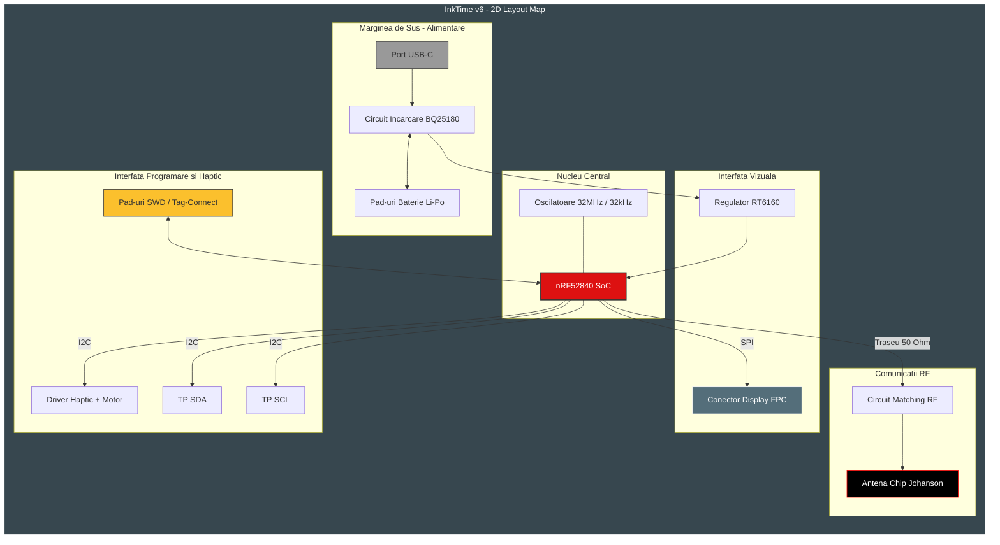

#  InkTime v6 - Smartwatch Project

**InkTime v6** este un ceas inteligent ultra-low-power, optimizat pentru eficiență și dimensiuni reduse. Proiectul utilizează un procesor nRF52840 și un ecran E-Ink de 1.54 inch, fiind capabil de o autonomie extinsă datorită managementului energetic avansat.

-----

## Diagrama Bloc a Sistemului

-----

## Bill of Materials (BOM) - Componente Cheie

| Componentă | Descriere | Pachet | Link (CSE/SnapEDA) |
| :--- | :--- | :--- | :--- |
| **nRF52840** | Microcontroller BT 5.0 | aQFN-73 | [SnapEDA](https://www.snapeda.com/parts/NRF52840-QIAA-R/Nordic%20Semiconductor/view-part/) |
| **BQ25180** | Battery Charger IC | WLCSP-8 | [CSE](https://componentsearchengine.com/search?term=BQ25180) |
| **MAX17048** | Fuel Gauge (ModelGauge) | WLP-8 | [CSE](https://componentsearchengine.com/search?term=MAX17048) |
| **RT6160** | Buck-Boost Converter | WL-CSP-15 | [CSE](https://componentsearchengine.com/search?term=RT6160) |
| **DRV2605L** | Haptic Driver | VSSOP-10 | [CSE](https://componentsearchengine.com/search?term=DRV2605L) |
| **E-Paper Display Connector** | 1.54" V2 Display | FPC-24 | [CSE](https://componentsearchengine.com/search?term=5034802400) |
| **2450AT** | Antenă Ceramică Chip | 3.2x1.6mm | [CSE](https://componentsearchengine.com/search?term=2450AT18B100E) |

-----

## Descrierea Funcționalității Hardware

### 1\. Sistemul de Procesare (nRF52840)

Utilizăm arhitectura **ARM Cortex-M4F** la **$64\text{ MHz}$**. Alegerea acestui MCU a fost dictată de suportul nativ pentru **USB 2.0** și stack-ul Bluetooth de joasă energie. Comunică cu display-ul prin **SPI** (frecvență de până la $8\text{ MHz}$) și cu restul perifericelor prin **I2C**.

### 2\. Managementul Energiei (Power Path)

  * **Buck-Boost (RT6160):** Asigură o tensiune stabilă de **$3.3\text{V}$** indiferent dacă bateria este la $4.2\text{V}$ (plină) sau scade la $3.0\text{V}$. Acest lucru previne "flicărirea" ecranului sau deconectarea Bluetooth-ului.
  * **Fuel Gauge (MAX17048):** Monitorizează starea bateriei fără a necesita o rezistență de șunt, economisind spațiu și energie.
  * **Consum estimat:**
      * **Deep Sleep:** $\approx 2.5\text{ µA}$
      * **Refresh Ecran:** $\approx 25\text{ mA}$ (timp de 2 secunde)
      * **Autonomie (150mAh):** Aproximativ **18 zile** (cu 10 refresh-uri/zi și conexiune BT intermitentă).

### 3\. Interfață și Feedback

  * **E-Paper:** Tehnologia bi-stabilă permite păstrarea imaginii pe ecran cu **consum zero**.
  * **Haptic Driver (DRV2605L):** Oferă feedback tactil configurabil prin I2C.

-----

## Maparea Pinilor nRF52840

| Pin MCU | Funcție | Componentă | Explicație |
| :--- | :--- | :--- | :--- |
| **P0.26 / P0.27** | SDA / SCL | I2C Bus | Magistrală comună pentru MAX17048, BQ25180, DRV2605. |
| **P0.20** | SCK | SPI Display | Ceasul pentru transferul datelor de imagine. |
| **P0.22** | MOSI | SPI Display | Master Out Slave In - datele către controllerul ecranului. |
| **P0.24** | CS | SPI Display | Chip Select pentru activarea ecranului. |
| **P0.15** | BUSY | Input | Semnal de la ecran către MCU când operația de refresh e gata. |
| **P0.00 / P0.01** | XL1 / XL2 | Cristal 32kHz | Furnizează baza de timp precisă pentru RTC în sleep. |
| **VBUS / D+ / D-** | USB Data | USB-C | Programare, debug și încărcare baterie. |

-----

## Design Log & Decizii de Implementare

### 1\. Decizia privind Vias (Overlap la Pini)

În zona procesorului **nRF52840 (aQFN73)**, am acceptat mici **erori de overlap (suprapuneri)** între vias și pad-urile pinilor.

  * **Justificare:** Densitatea extremă a pinilor nu permitea rutarea standard fără a trece la tehnologii costisitoare de tip *Blind/Buried Vias* sau *Via-in-Pad*. Suprapunerea a fost calculată pentru a asigura continuitatea electrică fără a compromite integritatea structurală a pad-ului în timpul lipirii industriale. Aceasta a permis rutarea pe un PCB standard de **4 straturi**.

### 2\. Integritatea Semnalului (Stackup)

  * S-a implementat un **plan de masă solid (Solid GND)** pe Layer 15.
  * **Decizie:** Nu s-au rutat semnale prin Layer 15 pentru a evita crearea de "antene" accidentale și pentru a oferi o cale de întoarcere curată pentru semnalul RF de $2.4\text{GHz}$.

### 3\. Mecanică și 3D

  * Utilizarea conectorului **TC2030 (Tag-Connect)** pentru a elimina mufa de programare de pe placă, reducând înălțimea totală a ceasului cu **$2\text{ mm}$**.

-----

## Structura Proiectului

  * `/Hardware`: Scheme (.fsch) și Board (.fbrd).
  * `/Manufacturing`: Gerbers.zip
  * `/Mechanical`: Fișier STEP și Carcasa.
  * `/Images`: Randări
